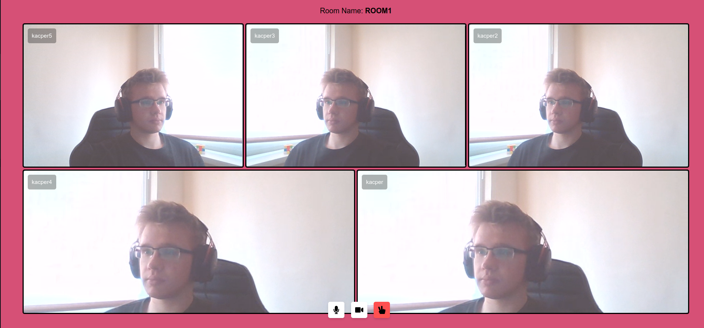

# VideoChatApp


##  About
Video chat application made with [Agora Web SDK](https://docs.agora.io/en/All/API%20Reference/web/index.html) and Django. It uses backend database to store info about room members and [agora token builder](https://pypi.org/project/agora-token-builder/) to generate token server in Python & Agora RTM/RTC.
<p align="center">

<br/>
Screenshot of lobby - enter room name and your nick 
<br/>
<br/>

<br/>
Screenshot of room - it allows user to mute its microphone and turn off its camera.
</p>


## How to run
```
git clone https://github.com/Kacper-Cyganik/Video-Chat-App.git
```
```
pip install -r requirements.txt
```
### Update the credentials of Agora:
- register at agora.io to generate your app ID and certificate.
- create .env file inside core/core and update it with credentials.
```
SECRET_KEY="your django secret key"
AGORA_APP_ID="your agora app id"
AGORA_APP_CERTIFICATE="your agora app certificate"
```
- Also place agora app id in core/static/js/streams.js:
```
const APP_ID = "your agora app id";
```
### Make migrations and run server
```
python3 manage.py makemigrations
python3 manage.py migrate
```
```
python3 manage.py runserver
```

# To Do
 - use Redis to store info about users,
 - add text chat to rooms, 